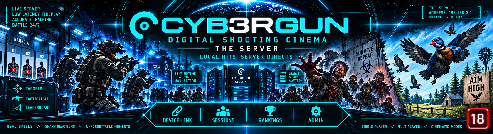

# CYB3RGUN THESERVER

**Digital Shooting Cinema. The venue server.** The nervous system of a CYB3RGUN cinema: scores, sessions, devices, rankings, direction. One binary, no external services, built in Go.

> [!IMPORTANT]
> **For adults only.** CYB3RGUN is not suitable for anyone under 18 and is developed with an 18+ classification as its target.
>
> **No finished release is published, and none ever will be.** There is no download, no installer and no binary. Whoever wants to run it compiles, configures, sets up and administers it themselves.

---

CYB3RGUN is a shooting cinema. Players shoot at screens, projections, mannequins and moving targets with a pistol that carries an infrared camera. Nobody shoots at people, and nothing shoots back: a target that is not hit within its time window counts against the player, and that is the whole rule. The pistol sees four infrared beacons around every target, computes where it points at the moment of the shot, and tells the target by radio. The target reacts in milliseconds, on its own, without asking anyone.

theserver is everything that is not that moment. It collects what the targets journal, counts the points, runs the sessions, directs the room, keeps the devices, and later the members, the bookings, the leagues and the franchise statement. It runs on a Raspberry Pi built into a single target at home and on a rack machine in a hall with 500 targets, from the same binary.

One rule holds it together: **the hit reacts locally, the server directs, the cloud is optional.** If theserver disappears, every target keeps playing and delivers later. Nothing is lost, nothing is counted twice.

---

## What This Repository Is

This repository is **source available.** The code can be read, compiled and run for personal, non commercial evaluation. The licence text is being finalised and will be published in `LICENSE`; until then no right to redistribute the code or anything derived from it is granted, and commercial use requires a written agreement with IT and More Systems.

- **No release.** No download, no installer, no binary, now or later. The distribution is the source itself.
- **Build it yourself.** One `go build` produces the whole server. The steps are under [Development](#development).
- **No content.** theserver ships no scenarios, no characters, no media. Scenario packages are a separate, closed tier delivered as signed content under a rental and server agreement.
- **Everything is documented.** Every architectural choice is written down with its reason in [docs/decisions.md](https://github.com/cyb3rgun/theserver/blob/main/docs/decisions.md), and every pass of work leaves a briefing and a handover.

---

## The System

CYB3RGUN is one product in five repositories. They share one protocol, one set of rules and one naming scheme.

| Repository | What it is | Runs on |
| --- | --- | --- |
| [thefirmware](https://github.com/cyb3rgun/thefirmware) | The ESP32 side: the pistol (camera, IMU, trigger, aim computation, radio), the target module (beacon driver, radio, USB bridge) and the small all in one display target. | ESP32-S3, ESP32-P4 |
| [theclient](https://github.com/cyb3rgun/theclient) | The target computer. Takes the shot event from the target module over USB, decides the hit against the zone model and the time window, shows picture and sound, keeps the journal, talks to theserver. | Raspberry Pi, Mini PC |
| [thegame](https://github.com/cyb3rgun/thegame) | The Unreal Engine 5.8 shooting simulator. The big cinema target: real ballistics, per bone hit zones, exchangeable scenarios. Renders what theclient decides on the large format. | Windows PC |
| **theserver** (this repository) | The venue server. Scores, sessions, devices, rankings, direction, administration, later members, booking and the franchise statement. | Raspberry Pi to rack |
| [thesite](https://github.com/cyb3rgun/thesite) | The public website, including FIND A CINEMA, the map of licensed venues. | Web |

How a shot travels:

```
PISTOL (ESP32)  --ESP-NOW-->  TARGET MODULE (ESP32)  --USB-->  TARGET COMPUTER (theclient)
   camera sees                 drives the beacons,               decides the hit,
   four beacons,               hears the pistol,                 picture and sound,
   computes the aim            acknowledges the shot             journals the event
                                                                        |
                                                              WebSocket over TLS
                                                                        v
                                                                THESERVER (this)
                                                               scores, sessions,
                                                               devices, rankings,
                                                               direction, admin
                                                                        |
                                                                        v
                                                              OPTIONAL FEDERATION
                                                            accounts across venues,
                                                            FIND A CINEMA, leagues
```

Nothing real time ever crosses a network. The pistol and the target module speak ESP-NOW directly, connectionless, in single digit milliseconds. theserver sees the result afterwards, over a cable or WiFi, and it is never asked before a target reacts.

### Target classes

| Class | Hardware | Sound | Server link | Use |
| --- | --- | --- | --- | --- |
| **A** | ESP32 display board with camera beacons and radio on one chip | built in codec, clicks and hit markers | WiFi, or Ethernet where the board has it | home targets, clubs, halls with many small targets |
| **B** | Raspberry Pi plus target module | proper audio | Ethernet, WiFi as fallback | experience rooms, mannequins, moving targets |
| **C** | Mini PC plus target module, thegame as renderer | cinema audio | Ethernet | the 60 x 220 cm digital shooting cinema |

All three speak the same protocol to theserver, carry the same journal and the same device identity. An operator mixes them freely, and a home player upgrades from A to B to C without changing anything on the server or the pistol.

---

## The Rule

**The hit reacts locally. The server directs. The cloud is optional.**

Every target decides on its own that it was hit, reacts on its own, keeps score on its own and writes every event to its own journal. theserver collects, counts, coordinates and directs. If it fails, the room keeps playing.

This is enforced by the shape of the data, not by good intentions:

- Every event carries a device id, a per device sequence number that never repeats, and a globally unique 16 byte event id.
- theserver acknowledges the highest contiguous sequence it holds. A target resends everything above that after any reconnect.
- Storage is idempotent on the event id. A replayed event is acknowledged and not stored twice. A reused sequence with a different event id is a conflict, never a silent overwrite.
- Events are immutable. Rankings are computed from the journal every time they are asked for; there is no score table to drift out of sync.

---

## What It Does Today

| Area | Capability |
| --- | --- |
| **Device link** | WebSocket over TLS at `/link/v1`, CBOR messages, handshake with replay, cumulative acknowledgements, commands from the server with results, keepalive, newest connection wins; devices report the scenario versions they hold and are told when to fetch one |
| **Journal** | SQLite in WAL mode, embedded versioned migrations, immutable events, contiguous acknowledgement, sequence epochs for device reset |
| **Devices** | Registry with kind, class, room, zone, status (pending, approved, blocked), hashed device tokens, token rotation, reset, live disconnect on revoke |
| **Sessions** | Create, start, stop, assign devices; events are attributed to sessions by device time, so late deliveries land in the right session |
| **Rankings** | Per session or over everything, computed from hit and miss events, verified against an independent computation |
| **Scenarios** | Packages as `docs/scenario.md` defines them, checked on upload with every problem named in English and German, kept as drafts, published versions never change; targets download them with their own token and report them installed; a session plays one published version, checked against the age its devices are set for |
| **API v1** | JSON over HTTPS under `/api/v1`, bearer tokens for administration, every route documented in `docs/openapi.yaml` and served at `/api/v1/openapi.yaml` |
| **Admin** | Login, devices with what they hold, sessions, the scenario catalogue with upload and check, live ranking, and every setting editable with its help; English and German; server rendered pages with HTMX 4, no build step, no CDN |
| **TLS** | A self signed certificate is created on first start and its fingerprint logged; operators replace two files to install a real one |
| **Configuration** | One registry describes every setting with type, range, restart flag and texts in English and German; defaults, TOML file, environment variables, command line flags, in that precedence; changes from the admin page or the API are written back to the file and take effect at once where they can |
| **Simulator** | `simtarget`, a second binary that behaves like a target, journals locally, drops its connection on purpose and replays, installs announced scenario packages, so the whole chain runs under load without firmware |

---

## Measured

Measurements are taken on real hardware and recorded with the machine they ran on. These ran on an i9-11900K with 16 threads under Windows 11, each from a fresh database.

| Measurement | Result |
| --- | --- |
| Journal write | 10,000 events in one transaction in 169 ms, about 59,000 events per second |
| Single target, 60 s, a forced disconnect every 10 s | 302 sent, 302 stored, 5 drops, 51 replayed, 0 duplicates, 0 gaps |
| 50 targets, 5 events per second each, 60 s | 15,064 sent, 15,064 stored, every device contiguous, no error or warning in the log |
| Server load during the 50 target run | about a third of one core, 36 MB working set, 20 threads |
| Revoke a device with a live connection | disconnected after 449 ms |
| Reset a device with a live connection | connection closed after 1 ms, device restarts at sequence 1 in the next epoch, no regression |
| Ranking after a 60 s run of three targets with a reset and a token change | 801 events, identical to an independent CBOR decoder run over the raw database |
| Ranking over 270,000 events in 30 sessions | session ranking 14 ms, ranking over everything about 420 ms |
| Replay of 301 already stored events | 0 stored, 301 duplicates, ranking unchanged |

Indexes were chosen by measurement. Two indexes that the briefing asked for made the ranking slower and were rejected with the numbers recorded in the decision log.

---

## Network In A Venue

theserver is not in the hit path, so the network only has to be good enough for events and content, not for shots.

- **Pistol to target:** ESP-NOW, broadcast, no fixed peers, no peer limit. The target acknowledges, the pistol resends until acknowledged.
- **Target to theserver:** Ethernet where the target has it (class B and C), WiFi otherwise (class A). One dedicated SSID for the system.
- **One fixed 2.4 GHz channel** for the whole venue. Devices that run ESP-NOW and WiFi on the same chip must share the channel, so automatic channel selection is disabled everywhere and modem sleep is off on those devices.
- **Access points** (UniFi in the reference design) all on that channel, 20 MHz, 5 GHz off for the system SSID, band steering off, minimum RSSI kick off off, every access point wired to a PoE switch, theserver wired to the same switch.
- **Large content** (scenario packages, media, firmware) is fetched over HTTPS as resumable, checksummed, signed downloads, never over the device link.

At home one router on a fixed channel replaces all of it.

---

## The Franchise Model

CYB3RGUN is built as a franchise. IT and More Systems is the manufacturer and franchisor; the venues are run by operators under the CYB3RGUN brand. theserver is the part of the system that makes this work without anyone handling anyone else's money.

**The base software is free.** theserver, the target software and the firmware run without a licence fee, at home, in a club, in a hall, forever. Self hosting is free. What costs money is what the manufacturer delivers on top: scenario content, updates, models, support, hosting as a service, and the brand.

**The fee is a share of system revenue above a threshold.** System revenue is what is booked through theserver: sessions, play time, tournaments. Gastronomy and merchandise are the operator's alone, because the system neither creates nor measures them. The threshold is per month and the rate is per venue, both set by the manufacturer with a validity date, so early partners can be treated differently from venue number fifty. A venue below the threshold pays nothing. The working figure for the rate is seven percent.

**theserver computes, it never collects.** At the end of each month the server sums the system revenue, applies threshold and rate, shows the result to the operator in advance, and sends a signed monthly statement to the manufacturer. The manufacturer issues the invoice from its own accounting. Nothing is debited automatically; theserver has no access to any account, no payment provider and no card terminal. It alerts the manufacturer when a venue crosses the threshold during the month, and it shows trends before the statement is due.

**Not a cash register.** theserver records what was played and sold, and exports the numbers for the operator's bookkeeping (CSV, DATEV format, the API). It connects to the operator's own point of sale system so a booked session appears there as an item and the register reports it paid, and it accepts online prepayment through the operator's own account at a payment provider. It never takes cash, prints a receipt or carries a fiscal signature unit, and it never becomes an electronic cash register in the legal sense.

**Enforcement is by contract and by signed content.** The source is open to read, so a cheating operator could remove the reporting; what he cannot remove is the brand and the content. Licensed scenarios, updates and federation access are delivered as signed packages that check the venue's licence. After warning, invoice, payment term and reminder, licensed content and updates freeze and the venue leaves the FIND A CINEMA map. The free base keeps running, unbranded and without content. Grace periods are contract terms and are configured, never hard coded.

**Owned pistols and federation.** A member can buy a pistol, or build one; it is registered to its owner and works in every federated venue, and every hit from it is credited to the member without a wristband. Rental pistols belong to the venue and are assigned to a player by an NFC wristband for the session. Accounts, owned pistols and wristbands are valid across venues through the optional federation, which is also the data source behind FIND A CINEMA on the website. A venue that loses its licence disappears from that map.

The capability map records which of these exist today and which are planned; none of the money related functions is part of the foundation yet, but the journal, the sessions and the device identities they need are.

---

## Configuration

Every setting is declared once, in the settings registry: its type, default, unit, range or allowed values, whether a change needs a restart, and a label, a description and a longer why in English and German. The configuration file, the environment variables, the flags, the API and the admin page all come from it. The full list is in [docs/settings.md](https://github.com/cyb3rgun/theserver/blob/main/docs/settings.md), written by `theserver settings doc`.

Precedence, highest first: command line flags, environment variables prefixed `THESERVER_`, the TOML file, built in defaults.

```
theserver --write-default-config data/theserver.toml
```

writes every setting with its label, description, default and range. The sections today: `server` (listen address, data directory), `tls` (certificate and key, empty means the bootstrap files), `store` (database wait time), `content` (upload limit, content directory), `link` (acknowledgement interval and batch, ping interval, ping answer time, greeting time), `log` (level, format) and `admin` (language, login duration).

**Changing settings.** Open `/admin/settings`. Every setting shows its current value, default, range and source, a short description on hover and the why to expand, in English or German. Saving writes the file the server was started with `--config`; without `--config` the first save creates `theserver.toml` in the data directory, which every later start without `--config` reads. The log level, the device link timings and the admin settings take effect at once, the others after a restart, and the page lists them until then. A setting that an environment variable or a flag sets is locked on the page. Every change is logged with the admin token, the old and the new value. The same works through `GET` and `PUT /api/v1/settings` and `POST /api/v1/settings/reset`.

---

## Scenarios

A scenario is a package: a `manifest.toml`, its media, a `cover.png`, one directory or zip. [docs/scenario.md](https://github.com/cyb3rgun/theserver/blob/main/docs/scenario.md) defines it, and `pkg/scenario` is the one piece of code that reads and checks it, for theserver, for the editor and for theclient. The manifest lists every file of the package with its SHA-256.

**Upload.** On `/admin/scenarios`, or `POST /api/v1/scenarios` with the zip. The package is checked at once: every problem is named with its field, in English or German, and a package with problems is kept as a draft that cannot be published. The manifest carries the version; an upload of a version that is published already is refused.

**Publish.** A draft without problems is published on its page. A published version never changes and is never deleted; a fix is a new version. Every version is kept in `content/<id>/<version>/package.zip` below the data directory, exactly as it was uploaded.

**Build.** The scenario editor builds a scenario in the browser, without touching a file: `/admin/scenarios` opens a draft, empty or as a copy of a published version, and `/admin/editor/<draft id>` is the editor. Upload a video, draw zones on the paused frame, move them through time with keyframes, give them values and classes, put appearances on the timeline, choose the reactions and the rules, play it with the mouse as the pistol, check it and publish. Drafts live on the server with their media; the server writes the manifest, computes the hashes, zips the package and publishes it through the same chain an upload takes. Every field carries a description and a longer why, in English and German. [docs/editor.en.md](https://github.com/cyb3rgun/theserver/blob/main/docs/editor.en.md) is the guide.

**Two people, one draft.** Opening the editor takes the lock of that draft; the page keeps it while it is open and lets it go when it is left. Somebody who comes to a draft another person is holding gets a page that reads only and names the holder, with a button that takes it over after a confirmation; both names go into the log. Every change is saved at once, and there are two ways back: undo and redo in the browser, Ctrl and Z, and the version list beside the media panel, which holds the last twenty changes of the draft on the server and restores any of them.

**Play.** A created session gets one published version on `/admin/sessions`. A scenario rated above the age a device of the session is set for is refused; a device is set for 18 unless it is set lower with `--min-age` or on its page. Every device of the session that does not hold the version is told over the device link, a device that is offline when it connects again. The target downloads the package over HTTPS with its own token, checks it and reports it installed; the device page shows what every target holds and whether it is current.

---

## Command Line

```
theserver serve [--config <file>] [--data-dir <dir>] [--listen <addr>] [--log-level <level>]
theserver device add --id <id> --kind target|controller|bridge [--class esp|pi|pc]
                     [--name <name>] [--room <room>] [--zone <zone>] [--min-age 0|6|12|16|18]
theserver device list
theserver device revoke --id <id>
theserver device reset <id>
theserver admin token add --name <name>
theserver admin token list
theserver admin token revoke <id>
theserver settings doc [--out <file>]
theserver db info
theserver --write-default-config <file>
theserver --version
theserver help

simtarget [--server wss://<host>:8443] --id <id> --token <token> [--insecure]
          [--rate <n>] [--controllers <n>] [--journal <dir>]
          [--drop-every <s>] [--duration <s>] [--class esp|pi|pc] [--log-level <level>]
          [--holdings <id>@<version>,...] [--content-dir <dir>]
```

`serve` is the default: a first argument that is a flag runs the server, so `theserver --version` and `theserver --write-default-config` need no subcommand. Every subcommand also takes `--config <file>` and `--data-dir <dir>`; without `--config` they read `theserver.toml` in the data directory when it is there. `--class` defaults to `esp`, `--min-age` to `18`, `--server` to `wss://127.0.0.1:8443`, `--content-dir` to `content` in the journal directory of the simulator.

Device and admin tokens are shown exactly once, when created. Only their hashes are stored.

---

## Architecture

```
+-------------------------------------------------------------------+
|                          ADMIN PAGES                              |
|  devices / sessions / scenarios / editor / ranking / settings     |
+-------------------------------------------------------------------+
|                            API v1                                 |
|  devices / sessions / scenarios / drafts / rankings / settings    |
+-------------------------------------------------------------------+
|        SCORING        |        LINK         |      TLS BOOT       |
|  rankings from the    |  WebSocket, CBOR,   |  self signed cert   |
|  journal              |  replay, commands   |  on first start     |
+-------------------------------------------------------------------+
|        CONTENT        |               SCENARIO                    |
|  packages on disk,    |  manifest, checks with problem codes,     |
|  immutable versions   |  manifest hash; shared with the targets   |
+-------------------------------------------------------------------+
|                            STORE                                  |
|  SQLite (WAL), migrations, devices, sessions, events, tokens,     |
|  scenario index, holdings                                         |
+-------------------------------------------------------------------+
|          CONFIG  /  SETTINGS  /  I18N  /  VERSION  /  LOGGING     |
+-------------------------------------------------------------------+
```

Four rules hold the structure together:

1. **One binary.** No external database, broker or runtime. Copy, start, done.
2. **The store never decodes payloads.** Only the link and the scoring package understand CBOR; everything else treats an event as opaque bytes with an identity.
3. **The API is the only truth.** The admin pages call the same handlers in process; nothing exists on a page without a working call behind it.
4. **Measurements beat briefings.** An index or a code path that measures worse than the briefing expected is rejected, with the numbers recorded.

---

## Project Structure

```
theserver/
+-- cmd/
|   +-- theserver/          # The server binary: serve, device, admin, db
|   +-- simtarget/          # The simulated target
+-- internal/
|   +-- admin/              # Admin pages, templates, embedded HTMX
|   +-- config/             # Layered configuration with sources, written back
|   +-- content/            # Scenario packages and editor drafts on disk
|   +-- editor/             # The fields of the scenario editor with their help
|   +-- httpapi/            # Router, health, API v1, OpenAPI
|   +-- i18n/               # English and German texts of the admin pages
|   +-- link/               # Device link: handshake, replay, commands, keepalive
|   +-- mediakind/          # Container and codec of a media file, from its header
|   +-- scoring/            # Rankings from the journal
|   +-- settings/           # The registry of every setting
|   +-- simtarget/          # Simulator logic: generator, device loop, installs
|   +-- store/              # SQLite, migrations, devices, sessions, events, tokens, scenarios
|   +-- tlsboot/            # Self signed certificate bootstrap
|   +-- version/            # Build information
+-- pkg/                    # The public surface, versioned by tags (D-048, D-049)
|   +-- journal/            # Device side journal: sequence, epoch, unacked, ack, replay
|   +-- protocol/           # CBOR message types and codec for link v1
|   +-- scenario/           # The scenario model: manifest, checks, hash, rules, fixtures
+-- docs/                   # Concept, protocol, capabilities, decisions, seasons,
|   +-- briefings/          #   one briefing per pass
|   +-- handovers/          #   one handover per pass
+-- tools/                  # Dash check and maintenance scripts
+-- .github/assets/         # Repository presentation
```

---

## Status

| Component | Status |
| --- | --- |
| Layered configuration, health, graceful shutdown | Working |
| SQLite journal with migrations and contiguous acknowledgement | Working |
| Device registry, tokens, revoke, reset with epochs | Working |
| Sessions with device time attribution | Working |
| Device link with handshake, replay, commands, keepalive | Working |
| TLS bootstrap | Working |
| Simulated target with local journal and forced drops | Working |
| Rankings, verified against an independent computation | Working |
| API v1 with OpenAPI | Working |
| Admin pages: devices, sessions, scenarios, ranking, settings | Working |
| Journal retention, backup and restore | Planned |
| Configuration editable from the admin page, English and German | Working |
| Passkeys, roles, audit log | Planned |
| Device certificates (mutual TLS) | Planned |
| Enrolment by shooting and by NFC, floor plan with live status | Planned |
| Time base broadcast and beacon multiplex direction | Planned |
| Scenario packages: check, catalogue, publish, download, holdings, age check | Working |
| Scenario editor: drafts, zones with keyframes, timeline, media, preview, publish | Working |
| Scenario editor: draft locking, undo and redo, version history | Working |
| Public packages for theclient: protocol, scenario, journal | Working |
| Staged distribution, signed packages and updates | Planned |
| Director screen, spectator screens | Planned |
| Members, wristbands, owned pistols, skill rating, leagues | Planned |
| Booking, price lists, revenue book, exports, franchise statement | Planned |
| Federation: FIND A CINEMA, accounts across venues | Planned |
| CIND3R3LLA assistant access with read, configure and control tiers | Planned |

The full map with phases is in [docs/capabilities.md](https://github.com/cyb3rgun/theserver/blob/main/docs/capabilities.md).

---

## Development

Built with Go on Windows and Linux. The newest stable Go release is used; the `go` directive in `go.mod` names it and the toolchain is resolved automatically.

**1. Clone**

```
git clone git@github.com:cyb3rgun/theserver.git
cd theserver
```

**2. Build**

```
go vet ./...
go test ./...
go build -trimpath -ldflags "-s -w" -o dist/ ./cmd/theserver
go build -trimpath -ldflags "-s -w" -o dist/ ./cmd/simtarget
```

With `-o dist/` Go names the binaries itself, `theserver.exe` and `simtarget.exe` on Windows, `theserver` and `simtarget` on Linux, so the commands below run in Git Bash, PowerShell and Linux shells alike.

For a Raspberry Pi, in bash:

```
GOOS=linux GOARCH=arm64 go build -trimpath -ldflags "-s -w" -o dist/linux-arm64/ ./cmd/theserver
```

The separate directory keeps the Pi binary from replacing the one for the machine you build on.

**3. First run**

```
dist/theserver --write-default-config data/theserver.toml
dist/theserver admin token add --name founder
dist/theserver device add --id tgt-01 --kind target --class esp
dist/theserver serve --config data/theserver.toml
```

The first commands create the data directory and the database; the server adds a self signed certificate, logs its fingerprint and listens on `:8443`. Open `https://127.0.0.1:8443/admin`, accept the certificate, log in with the admin token.

**4. A target**

```
dist/simtarget --server wss://127.0.0.1:8443 --id tgt-01 --token <token> --insecure --rate 5 --drop-every 10
```

Watch the ranking page update. Stop with Ctrl+C; the server shuts down cleanly.

**Hard won notes**

- `go mod tidy` drops a module that nothing imports yet. Add the dependency in the pass that first imports it, at the version `go get @latest` resolved and recorded.
- Shell heredocs on Windows eat backslashes in Go source. Write files with an editor tool, patch with Python.
- Processes started from Git Bash inherit "ignore Ctrl+C". Test graceful shutdown with a real console or a real CTRL_C_EVENT.
- On S3 boards with octal PSRAM, GPIO 35 to 37 are not free. That is a firmware note, but it is recorded here because the first person who hits it will look here.

---

## How This Project Is Built

Development runs in seasons. A season ends when the founder says so, and leaves its record in the repository: the decisions in the decision log, the state in the season table, the measurements with their machine. Within a season the work is cut into briefings, each a single closed piece with its decisions stated up front and its acceptance criteria written before the work starts. Every pass ends with a handover.

Rules that have earned their place:

- **Decisions are recorded with their reason.** The decision log is numbered and never rewritten.
- **No invented versions.** Every dependency is added at the version the module proxy resolves, and that version is written down.
- **Bugs are fixed forward.** Nothing is reverted.
- **Measurements beat opinions.** No performance claim and no index enters the project without a number behind it.
- **A gap is a question, never a substitution.** The implementer stops and asks instead of guessing.
- **Design problems are solved, not deleted.** Hiding, removing or postponing is never the answer to something that looks wrong.

---

## Documentation

| Resource | Link |
| --- | --- |
| Server concept, the living reference | [docs/concept.md](https://github.com/cyb3rgun/theserver/blob/main/docs/concept.md) |
| Device link protocol | [docs/protocol.md](https://github.com/cyb3rgun/theserver/blob/main/docs/protocol.md) |
| Capability map with phases | [docs/capabilities.md](https://github.com/cyb3rgun/theserver/blob/main/docs/capabilities.md) |
| Architectural decisions with rationale | [docs/decisions.md](https://github.com/cyb3rgun/theserver/blob/main/docs/decisions.md) |
| Every setting with default, range and help | [docs/settings.md](https://github.com/cyb3rgun/theserver/blob/main/docs/settings.md) |
| The scenario model | [docs/scenario.md](https://github.com/cyb3rgun/theserver/blob/main/docs/scenario.md) |
| The editor, for the person who builds a scenario | [docs/editor.en.md](https://github.com/cyb3rgun/theserver/blob/main/docs/editor.en.md), [docs/editor.de.md](https://github.com/cyb3rgun/theserver/blob/main/docs/editor.de.md) |
| Seasons and passes | [docs/seasons.md](https://github.com/cyb3rgun/theserver/blob/main/docs/seasons.md) |
| API description | [docs/openapi.yaml](https://github.com/cyb3rgun/theserver/blob/main/docs/openapi.yaml) |
| Briefings, one per pass | [docs/briefings](https://github.com/cyb3rgun/theserver/tree/main/docs/briefings) |
| Handovers, one per pass | [docs/handovers](https://github.com/cyb3rgun/theserver/tree/main/docs/handovers) |
| The game, the big cinema target | [cyb3rgun/thegame](https://github.com/cyb3rgun/thegame) |
| The firmware, pistol and target module | [cyb3rgun/thefirmware](https://github.com/cyb3rgun/thefirmware) |
| The client, the target computer | [cyb3rgun/theclient](https://github.com/cyb3rgun/theclient) |
| The website and FIND A CINEMA | [cyb3rgun/thesite](https://github.com/cyb3rgun/thesite) |

---

## License

Source available, not open source. Copyright 2026 Sascha Daemgen, IT and More Systems, Recklinghausen, Germany. All rights reserved.

- The source code may be viewed, compiled and run for personal, non commercial evaluation.
- Redistribution of the source code or any derivative, in whole or in part, is not permitted without written permission.
- Commercial use of any kind requires a written agreement.
- Scenario content is not covered by this licence and is licensed separately.
- No warranty of any kind.

The binding text will be published as `LICENSE` in this repository.

---

## Legal Notice

CYB3RGUN is a shooting cinema. Players shoot at screens, projections and physical targets. Nobody shoots at people and no device shoots at a player.

The product is made for adults. It is not suitable for anyone under 18 and is developed with an 18+ classification as its target.

No finished release of this product is published, and none ever will be. Anyone who builds and runs it from this repository does so on their own responsibility, on their own machine.

theserver never handles money. It records what was played, computes and reports; it is not a cash register and does not become one.

---

## Acknowledgments

The Go team for a toolchain that turns a server into one file. The maintainers of [modernc.org/sqlite](https://gitlab.com/cznic/sqlite), [fxamacker/cbor](https://github.com/fxamacker/cbor), [coder/websocket](https://github.com/coder/websocket) and [htmx](https://htmx.org/) for the four dependencies this project needs.

---

*CYB3RGUN is a product of IT and More Systems, Recklinghausen, Germany.* *Shoot. Train. Improve.*

**CYB3RGUN - The hit reacts locally. The server directs.**
